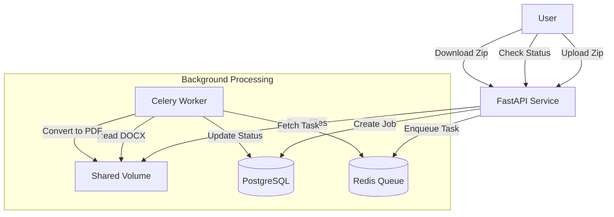
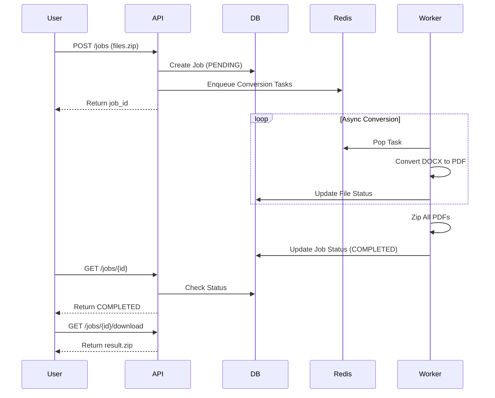

# Bulk DOCX to PDF Conversion Service

## Architectural Overview

This service is designed as an asynchronous microservice using **FastAPI** for the REST API and **Celery** for background processing.

### Key Components:
- **API Service (FastAPI)**: Handles file uploads, job creation, and status checking. It is stateless and decoupled from the heavy conversion workload.
- **Worker Service (Celery + LibreOffice)**: Consumes tasks from Redis. It uses a containerized instance of LibreOffice (via `soffice --headless`) to perform robust DOCX-to-PDF conversions.
- **Redis**: Acts as the message broker for Celery and result backend.
- **PostgreSQL**: Stores persistent state about jobs and individual files (Job ID, Status, Timestamps).
- **Shared Storage**: A Docker volume (`shared_data`) is mounted to both API and Worker containers to allow access to uploaded files and generated PDFs without network transfer overhead.

### Flow:
1.  **Upload**: User uploads a ZIP of DOCX files to `POST /api/v1/jobs`.
2.  **Queue**: API unzips files to `storage/processing/{id}`, creates DB records, and queues a `convert_file` task for each file using a Celery Group.
3.  **Process**: Workers pick up tasks, convert DOCX to PDF using LibreOffice, and save to `storage/outputs/{id}`.
4.  **Finalize**: Once all conversions are done, a `finalize_job` task runs (via Celery Chord/Chain), zipping the PDFs into `storage/outputs/{id}.zip`.
5.  **Download**: User checks status via `GET /api/v1/jobs/{id}` and eventually downloads the result via `GET /api/v1/jobs/{id}/download`.

## Architecture Diagrams

### System Design


### Sequence Flow


## Setup and Running

### Prerequisites
- Docker Desktop (Must be installed and running)

### Quick Start (The Easiest Way)

1.  **Clone the Repository**:
    ```bash
    git clone <your-repo-url>
    cd <your-repo-name>
    ```

2.  **Run with Docker**:
    ```bash
    # This single command downloads DB, Redis, and starts the App
    docker-compose up --build
    ```

3.  **Use the App**:
    Open [http://localhost:8000/docs](http://localhost:8000/docs) in your browser.

### Running the Application

1.  **Build and Start**:
    ```bash
    docker-compose up --build
    ```
    This will start the API on `localhost:8000`, the Worker, Redis, and Postgres.

2.  **Access API Documentation**:
    Open your browser to [http://localhost:8000/docs](http://localhost:8000/docs) to see the interactive Swagger UI.

## API Documentation

### 1. Submit Job
- **Endpoint**: `POST /api/v1/jobs`
- **Body**: `multipart/form-data` with key `file` (must be a .zip file).
- **Response**:
    ```json
    {
      "job_id": "uuid...",
      "file_count": 5
    }
    ```

### 2. Check Job Status
- **Endpoint**: `GET /api/v1/jobs/{job_id}`
- **Response**:
    ```json
    {
      "job_id": "uuid...",
      "status": "COMPLETED",
      "created_at": "...",
      "download_url": "/api/v1/jobs/{job_id}/download",
      "files": [
        { "filename": "doc1.docx", "status": "COMPLETED" },
        { "filename": "doc2.docx", "status": "FAILED", "error_message": "..." }
      ]
    }
    ```

### 3. Download Results
- **Endpoint**: `GET /api/v1/jobs/{job_id}/download`
- **Response**: Returns the ZIP file containing converted PDFs.

## Development Notes

- **LibreOffice**: The worker container includes a full LibreOffice installation (~500MB+). This is necessary for high-fidelity conversion compared to pure Python libraries like `docx2pdf` (which requires Word installed) or `python-docx` (which doesn't do layout).
- **Scalability**: You can scale workers horizontally:
    ```bash
    docker-compose up --scale worker=3
    ```
